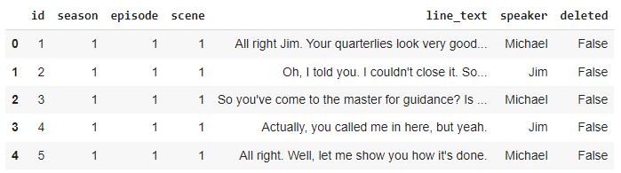

## Abstract
During this project, I aim to create a Neural Network to predict the speaker of a quote from *The Office (US)*. The original dataset contained all lines from the show, however, I only trained the model to predict lines from the top five most frequent speakers: Michael, Jim, Pam, Dwight, and Andy. I did tons of testing and adjustments to the architecture of the neural network to determine the optimal hyperparameters and layers for predicting the speaker of different lines. I trained a neural network that utilized Long Short-Term Memory, Bidirectional, Dropout, and Dense layers. The maximum accuracy I was able to obtain was around .37 and the minimum loss was around 2.2.

## Introduction
*The Office (US)* was an iconic mockumentary style comedy series that ran from 2005-2015. The show follows the Scranton, PA branch of Dunder Mifflin, a fictional mid-sized paper company headed by Regional Manager Michael Scott. All of the characters on *The Office* were big personalities with distinct traits and mannerisms. For example, Salesman Dwight Schrute is known for loving bears, beets, and Battlestar Galactica, while his fellow salesman Jim Halpert is known for being the office prankster and for bringing a very chill attitude to the office, and the Receptionist Pam Beasley is very shy and soft-spoken.

When watching the show, it is so interesting to watch their personalities mesh and bounce off of one another. These powerful characters that were developed and evolved over the 10 seasons of the show inspired me to attempt to create model that predicts the speaker of any given line from the office. 
## Methodology/Dataset
### Dataset
I was lucky to find my dataset on Kaggle (https://www.kaggle.com/datasets/fabriziocominetti/the-office-lines/data) where it had already been separated by character and labelled by season and episode.

### EDA
There are 59,909 lines/rows in the dataset. I first checked to see if there were any null values and what the data types were for each feature:

I first wanted to look at how many lines there were per season:

I then wanted to look at the distribution of the lines among all of the characters. Because there are many minor characters in the show that may be present for only one episode or even only one scene, I chose to visualize only the top 20 most frequent speakers.

The graph highlights the first problem that I encountered with this data: the class imbalance. Being the lead of the show, it is no surprise that Michael had the most lines out of all of the characters, however there is a steep drop off between Michaels total lines (around 12,000) and the character with the next most lines, which is Dwight (around 8,000). Additionally, there is a drop off between the fifth and sixth most frequent speakers, Andy and Kevin with around 4,000 and 2,000 lines respectively. I thought that using only the 20 most frequent speakers would be sufficient at first however the model was not learning any of the characters from Kevin and beyond, so I decided to only use the top five most frequent speakers: Michael, Jim, Dwight, Pam, and Andy. 

### Data Preprocessing

This is the process that I used for preprocessing my data. When I first ran the model, I had removed the stop words from the data and the model was overfitting really quickly (after 2 or 3 epochs). I decided to keep the stop words in the data to add some noise to the training data. 

### Model Architecture

## Results
The highest accuracy that I got for a model on one train-test-split was .3758. 
I performed a K-Fold Cross Validation with k = 6 to verify model results.
The model overfit very easily, which I tried to combat in several ways, including noise (stop words) and adding a dropout layer, however I continued to see test accuracy being significantly higher than the validation accuracy at the end of the epoch within 3-4 epochs. This can be seen especially in the K-Fold Cross Validation in every split. This graph shows the change in the test loss and validation loss for each epoch during the K-fold Cross-Validation with k = 5: 

.

And this graph shows the change in the test accuracy and validation accuracy over the K-Fold Cross Validation:

.

## Discussion
I was hoping to get at least 50% for the accuracy, but it is clear from the results of my neural network that there is more work to do. I think investigating the cause of the overfitting and employing more methods to fight against it will be crucial for making this model a better predictor of who the speaker of a given line is. 

## Conclusion

## References
